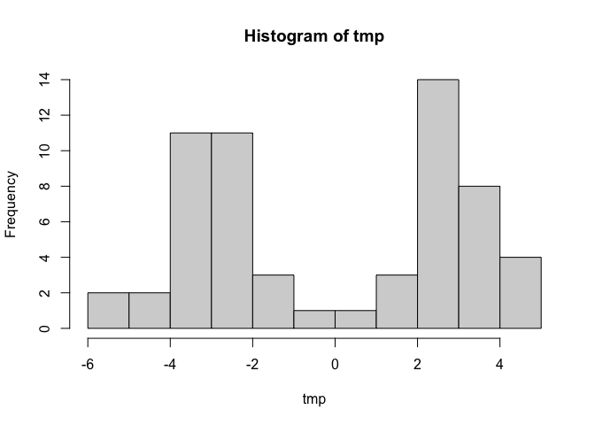
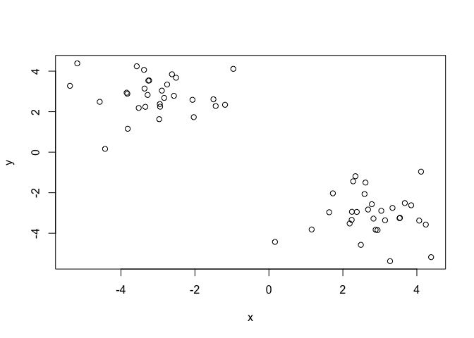
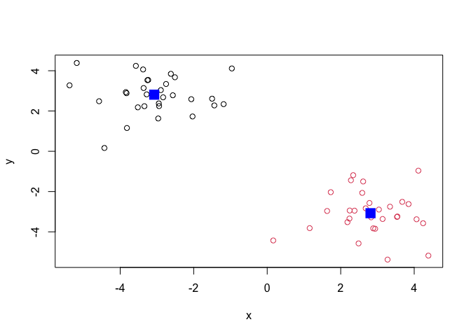
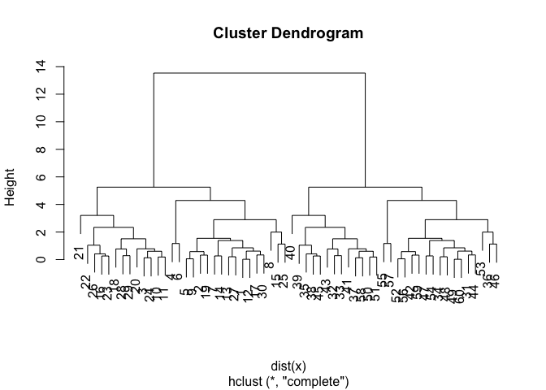
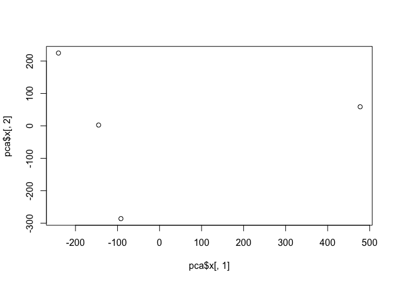
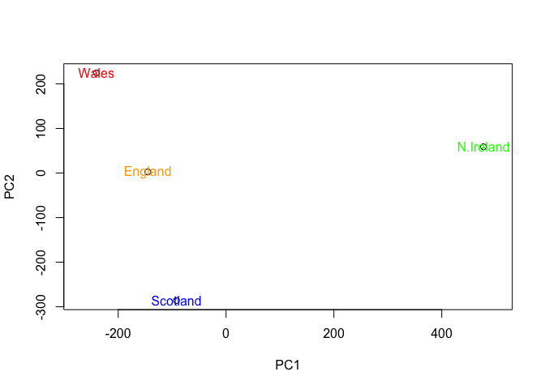
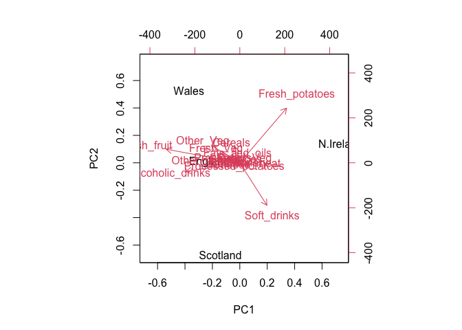
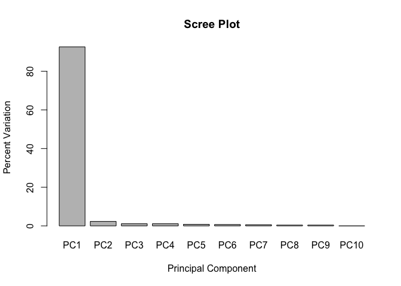

Machine Learning 1
================
Evelyn Diaz - PID:A15576617
10/21/2021

First up is clusterking methods \# Kmeans clustering

The function in base R to do Kmeans clustering is called `kmeans()`.

First make up some data where we know what the answer should be:

``` r
tmp<- c(rnorm(30, -3), rnorm(30,3))
tmp
```

    ##  [1] -3.2390960 -3.3627508 -2.9492639 -3.8170488 -3.8465688 -4.4296054
    ##  [7] -3.5732270 -5.1817474 -3.8276053 -3.5200410 -3.3415817 -3.2589282
    ## [13] -2.5111430 -3.3768769 -5.3787725 -1.1861722 -2.7519689 -2.0661380
    ## [19] -3.2794496 -2.9653303 -0.9623721 -2.0315993 -1.4390737 -2.9422520
    ## [25] -4.5745162 -1.4996274 -2.6215139 -2.5675400 -2.8318059 -2.8944123
    ## [31]  3.0386690  2.6799556  2.7820543  3.8464302  2.6110804  2.4859564
    ## [37]  2.2448079  2.2780090  1.7291805  4.1131935  1.6300734  2.8272309
    ## [43]  2.5855700  3.3416182  2.3399063  3.2749802  4.0636067  3.6750948
    ## [49]  3.5325237  2.2382745  2.1832300  2.8852830  4.3856695  4.2422699
    ## [55]  0.1642462  2.9376032  1.1556069  2.3762898  3.1401407  3.5420790

``` r
hist(tmp)
```

<!-- -->

``` r
x<-cbind(x=tmp, y=rev(tmp))
plot(x)
```

<!-- -->

> Q. Can we use kmenas() to cluster this setting k to 2 and nstart to
> 20?

``` r
km<- kmeans(x, centers=2, nstart = 20)
km
```

    ## K-means clustering with 2 clusters of sizes 30, 30
    ## 
    ## Cluster means:
    ##           x         y
    ## 1 -3.074268  2.811021
    ## 2  2.811021 -3.074268
    ## 
    ## Clustering vector:
    ##  [1] 1 1 1 1 1 1 1 1 1 1 1 1 1 1 1 1 1 1 1 1 1 1 1 1 1 1 1 1 1 1 2 2 2 2 2 2 2 2
    ## [39] 2 2 2 2 2 2 2 2 2 2 2 2 2 2 2 2 2 2 2 2 2 2
    ## 
    ## Within cluster sum of squares by cluster:
    ## [1] 58.2617 58.2617
    ##  (between_SS / total_SS =  89.9 %)
    ## 
    ## Available components:
    ## 
    ## [1] "cluster"      "centers"      "totss"        "withinss"     "tot.withinss"
    ## [6] "betweenss"    "size"         "iter"         "ifault"

> . Q: How many points are in each cluster?

``` r
km$size
```

    ## [1] 30 30

> . Q: what ‘component’ of your result object details cluster
> assignment/membership?

``` r
km$cluster
```

    ##  [1] 1 1 1 1 1 1 1 1 1 1 1 1 1 1 1 1 1 1 1 1 1 1 1 1 1 1 1 1 1 1 2 2 2 2 2 2 2 2
    ## [39] 2 2 2 2 2 2 2 2 2 2 2 2 2 2 2 2 2 2 2 2 2 2

> . Q: what ‘component’ of your result object details cluster center?

``` r
km$centers
```

    ##           x         y
    ## 1 -3.074268  2.811021
    ## 2  2.811021 -3.074268

> . PLot x colored by the kmenas cluster assignment and add custers as
> blue points.

``` r
plot(x, col=km$cluster) 
points(km$centers, col= "blue", pch=15, cex=2)
```

<!-- -->

# Hierchical clustering

A big limitation with k-means is that we have to tell it K (the number
of clusters we want).

Analyze this sme data with hclust() Demonstrate the ise of dist(),
hclust(), plot() and cutree(), functions to do clustering. Generate
dendrograms and return cluster assignment/ membership vector…

``` r
hc<- hclust(dist(x))
hc
```

    ## 
    ## Call:
    ## hclust(d = dist(x))
    ## 
    ## Cluster method   : complete 
    ## Distance         : euclidean 
    ## Number of objects: 60

There is a plot method for hclust result objects. Let’s see it:

``` r
plot(hc)
```

<!-- -->

To get our cluster membership vector we have to do more work. We have to
“cut” the tree where we think it makes sense. For this we want to use
`cutree()` function.

``` r
cutree(hc, h=6)
```

    ##  [1] 1 1 1 1 1 1 1 1 1 1 1 1 1 1 1 1 1 1 1 1 1 1 1 1 1 1 1 1 1 1 2 2 2 2 2 2 2 2
    ## [39] 2 2 2 2 2 2 2 2 2 2 2 2 2 2 2 2 2 2 2 2 2 2

You can also call cutree() setting k=the number of grps/clusters you
want.

``` r
grps<- cutree(hc, k=2)
```

Make our results plot:

``` r
plot(x, col=grps)
```

<!-- -->

# Hands-on Lab: Principal Component Analysis

## Q1. How many rows and columns are in your new data frame named x? What R functions could you use to answer this questions?

\#\#\#A: There are 17 rows and 4 columns in my data frame, we can get
this answer by using `dim()` or `nrow()` and `ncol()`.

``` r
url <- "https://tinyurl.com/UK-foods"
x <- read.csv(url)
x
```

    ##                      X England Wales Scotland N.Ireland
    ## 1               Cheese     105   103      103        66
    ## 2        Carcass_meat      245   227      242       267
    ## 3          Other_meat      685   803      750       586
    ## 4                 Fish     147   160      122        93
    ## 5       Fats_and_oils      193   235      184       209
    ## 6               Sugars     156   175      147       139
    ## 7      Fresh_potatoes      720   874      566      1033
    ## 8           Fresh_Veg      253   265      171       143
    ## 9           Other_Veg      488   570      418       355
    ## 10 Processed_potatoes      198   203      220       187
    ## 11      Processed_Veg      360   365      337       334
    ## 12        Fresh_fruit     1102  1137      957       674
    ## 13            Cereals     1472  1582     1462      1494
    ## 14           Beverages      57    73       53        47
    ## 15        Soft_drinks     1374  1256     1572      1506
    ## 16   Alcoholic_drinks      375   475      458       135
    ## 17      Confectionery       54    64       62        41

``` r
nrow(x)
```

    ## [1] 17

``` r
ncol(x)
```

    ## [1] 5

However, this should say we have 4 columns not five, let’s fix it: One
way

``` r
# Note how the minus indexing works
rownames(x) <- x[,1]
x <- x[,-1]
head(x)
```

    ##                England Wales Scotland N.Ireland
    ## Cheese             105   103      103        66
    ## Carcass_meat       245   227      242       267
    ## Other_meat         685   803      750       586
    ## Fish               147   160      122        93
    ## Fats_and_oils      193   235      184       209
    ## Sugars             156   175      147       139

This is dangerous, we can end up deleting a country’s data.

Another way:

``` r
url <- "https://tinyurl.com/UK-foods"
x <- read.csv(url, row.names=1)
head(x)
```

    ##                England Wales Scotland N.Ireland
    ## Cheese             105   103      103        66
    ## Carcass_meat       245   227      242       267
    ## Other_meat         685   803      750       586
    ## Fish               147   160      122        93
    ## Fats_and_oils      193   235      184       209
    ## Sugars             156   175      147       139

``` r
dim(x)
```

    ## [1] 17  4

This is what we want.

\#Q2. Which approach to solving the ‘row-names problem’ mentioned above
do you prefer and why? Is one approach more robust than another under
certain circumstances? \#\#\# A: We should prefer the second way to do
it, by setting the row name to one. This is better because we could end
up deleting impoartant data is we just override x with x-1 like in the
first way.

\#Q3: Changing what optional argument in the above barplot() function
results in the following plot?

``` r
barplot(as.matrix(x), col=rainbow(17))
```

<!-- -->

``` r
barplot(as.matrix(x), col=rainbow(17), beside = T)
```

<!-- -->

\#Q5: Generating all pairwise plots may help somewhat. Can you make
sense of the following code and resulting figure? What does it mean if a
given point lies on the diagonal for a given plot?

The resulting figure seems to show an expected trend line as a result of
the data that we have available. If a given point lies on the diagnoal,
then it is foloowing the general trend that the data has given us. If a
given point is further away from diagonal, then it is not following the
expected trend from the data.

``` r
pairs(x, col=rainbow(17), pch=16)
```

<!-- --> \#Q6. What
is the main differences between N. Ireland and the other countries of
the UK in terms of this data-set? From my understanding of the data, it
seems that England and North Ireland seem to have the most dramatic
differences, since their data plots are further apart.

# PCA to the rescue!

The main fucntion in base R for PCA is `prompt()` This wants the
transpose of our data.

``` r
pca<- prcomp(t(x))
summary(pca)
```

    ## Importance of components:
    ##                             PC1      PC2      PC3       PC4
    ## Standard deviation     324.1502 212.7478 73.87622 4.189e-14
    ## Proportion of Variance   0.6744   0.2905  0.03503 0.000e+00
    ## Cumulative Proportion    0.6744   0.9650  1.00000 1.000e+00

``` r
attributes(pca)
```

    ## $names
    ## [1] "sdev"     "rotation" "center"   "scale"    "x"       
    ## 
    ## $class
    ## [1] "prcomp"

\#Q7. Complete the code below to generate a plot of PC1 vs PC2. The
second line adds text labels over the data points.

``` r
plot(pca$x[,1], pca$x[,2])
```

<!-- -->

``` r
# Plot PC1 vs PC2
plot(pca$x[,1], pca$x[,2], xlab="PC1", ylab="PC2", xlim=c(-270,500))
text(pca$x[,1], pca$x[,2], colnames(x))
```

<!-- -->

# Q8. Customize your plot so that the colors of the country names match the colors in our UK and Ireland map and table at start of this document.

``` r
plot(pca$x[,1], pca$x[,2], xlab="PC1", ylab="PC2", xlim=c(-270,500))
colors<- c("orange", "red", "blue", "green")
text(pca$x[,1], pca$x[,2], colnames(x), col=colors)
```

<!-- -->

``` r
v <- round( pca$sdev^2/sum(pca$sdev^2) * 100 )
v
```

    ## [1] 67 29  4  0

``` r
z <- summary(pca)
z$importance
```

    ##                              PC1       PC2      PC3          PC4
    ## Standard deviation     324.15019 212.74780 73.87622 4.188568e-14
    ## Proportion of Variance   0.67444   0.29052  0.03503 0.000000e+00
    ## Cumulative Proportion    0.67444   0.96497  1.00000 1.000000e+00

``` r
barplot(v, xlab="Principal Component", ylab="Percent Variation")
```

<!-- -->

``` r
## Lets focus on PC1 as it accounts for > 90% of variance 
par(mar=c(10, 3, 0.35, 0))
barplot( pca$rotation[,1], las=2 )
```

<!-- -->

\#Q9: Generate a similar ‘loadings plot’ for PC2. What two food groups
feature prominantely and what does PC2 maninly tell us about?

``` r
par(mar=c(10, 3, 0.35, 0))
barplot( pca$rotation[,2], las=2 )
```

<!-- -->

The two food groups most prominent in this plot are fresh potatoes and
soft drinks. PC2 tells us something a little different than PC1. In PC2,
fresh potatoes in N. Ireland to right, soft drinks push it to the left.
Overall PC2 accounts for less variance so there’s less variacne (29%)
shown in the distribution (loading scores are closer to zero than in
pc1).

\#Biplot \#\# The inbuilt biplot() can be useful for small datasets

``` r
biplot(pca)
```

<!-- -->

\#Q10: How many genes and samples are in this data set?

``` r
url2 <- "https://tinyurl.com/expression-CSV"
rna.data <- read.csv(url2, row.names=1)
head(rna.data)
```

    ##        wt1 wt2  wt3  wt4 wt5 ko1 ko2 ko3 ko4 ko5
    ## gene1  439 458  408  429 420  90  88  86  90  93
    ## gene2  219 200  204  210 187 427 423 434 433 426
    ## gene3 1006 989 1030 1017 973 252 237 238 226 210
    ## gene4  783 792  829  856 760 849 856 835 885 894
    ## gene5  181 249  204  244 225 277 305 272 270 279
    ## gene6  460 502  491  491 493 612 594 577 618 638

``` r
dim(rna.data)
```

    ## [1] 100  10

There are 100 genes in this data set.

## Again we have to take the transpose of our data

pca &lt;- prcomp(t(rna.data), scale=TRUE)

## Simple un polished plot of pc1 and pc2

plot(pca*x*\[,1\], *p**c**a*x\[,2\], xlab=“PC1”, ylab=“PC2”)

``` r
## Again we have to take the transpose of our data 
pca <- prcomp(t(rna.data), scale=TRUE)
 
## Simple un polished plot of pc1 and pc2
plot(pca$x[,1], pca$x[,2], xlab="PC1", ylab="PC2")
```

<!-- -->

``` r
summary(pca)
```

    ## Importance of components:
    ##                           PC1    PC2     PC3     PC4     PC5     PC6     PC7
    ## Standard deviation     9.6237 1.5198 1.05787 1.05203 0.88062 0.82545 0.80111
    ## Proportion of Variance 0.9262 0.0231 0.01119 0.01107 0.00775 0.00681 0.00642
    ## Cumulative Proportion  0.9262 0.9493 0.96045 0.97152 0.97928 0.98609 0.99251
    ##                            PC8     PC9      PC10
    ## Standard deviation     0.62065 0.60342 3.348e-15
    ## Proportion of Variance 0.00385 0.00364 0.000e+00
    ## Cumulative Proportion  0.99636 1.00000 1.000e+00

``` r
plot(pca, main="Quick scree plot")
```

<!-- -->

``` r
## Variance captured per PC 
pca.var <- pca$sdev^2

## Percent variance is often more informative to look at 
pca.var.per <- round(pca.var/sum(pca.var)*100, 1)
pca.var.per
```

    ##  [1] 92.6  2.3  1.1  1.1  0.8  0.7  0.6  0.4  0.4  0.0

``` r
barplot(pca.var.per, main="Scree Plot", 
        names.arg = paste0("PC", 1:10),
        xlab="Principal Component", ylab="Percent Variation")
```

<!-- -->

``` r
## A vector of colors for wt and ko samples
colvec <- colnames(rna.data)
colvec[grep("wt", colvec)] <- "red"
colvec[grep("ko", colvec)] <- "blue"

plot(pca$x[,1], pca$x[,2], col=colvec, pch=16,
     xlab=paste0("PC1 (", pca.var.per[1], "%)"),
     ylab=paste0("PC2 (", pca.var.per[2], "%)"))

text(pca$x[,1], pca$x[,2], labels = colnames(rna.data), pos=c(rep(4,5), rep(2,5)))
```

<!-- -->

``` r
library(ggplot2)

df <- as.data.frame(pca$x)

# Our first basic plot
ggplot(df) + 
  aes(PC1, PC2) + 
  geom_point()
```

<!-- -->

``` r
# Add a 'wt' and 'ko' "condition" column
df$samples <- colnames(rna.data) 
df$condition <- substr(colnames(rna.data),1,2)

p <- ggplot(df) + 
        aes(PC1, PC2, label=samples, col=condition) + 
        geom_label(show.legend = FALSE)
p
```

<!-- -->

``` r
p + labs(title="PCA of RNASeq Data",
       subtitle = "PC1 clealy seperates wild-type from knock-out samples",
       x=paste0("PC1 (", pca.var.per[1], "%)"),
       y=paste0("PC2 (", pca.var.per[2], "%)"),
       caption="BIMM143 example data") +
     theme_bw()
```

<!-- -->

\#Gene loadings

``` r
loading_scores <- pca$rotation[,1]

## Find the top 10 measurements (genes) that contribute
## most to PC1 in either direction (+ or -)
gene_scores <- abs(loading_scores) 
gene_score_ranked <- sort(gene_scores, decreasing=TRUE)

## show the names of the top 10 genes
top_10_genes <- names(gene_score_ranked[1:10])
top_10_genes 
```

    ##  [1] "gene100" "gene66"  "gene45"  "gene68"  "gene98"  "gene60"  "gene21" 
    ##  [8] "gene56"  "gene10"  "gene90"
