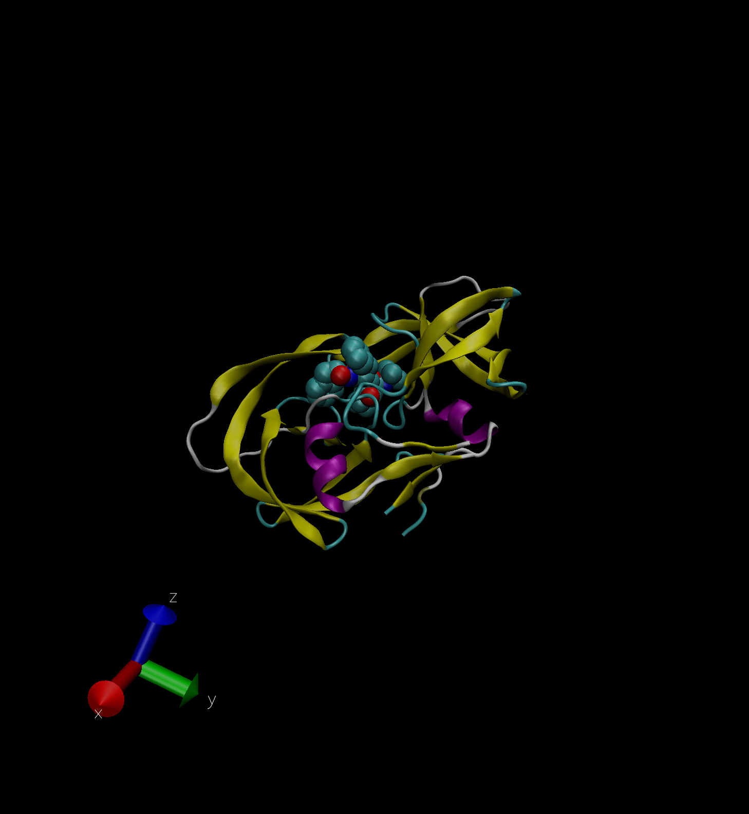

## R Markdown

\#Section1

```{r}
db<- read.csv("Data Export Summary.csv", row.names = 1)
head(db)
```

#Q1: What percentage of structures in the PDB are solved by X-Ray and Electron Microscopy. 
##X-ray=87.55% 
##EM=4.92%

```{r}
method.sums<- colSums(db)
round(method.sums/method.sums["Total"]*100,2)
```

#Q2: What proportion of structures in the PDB are protein?
##Proportion of structures = 87.36%

```{r}
round((db$Total/method.sums["Total"]) * 100, 2)


```

#Q3: Type HIV in the PDB website search box on the home page and determine how many HIV-1 protease structures are in the current PDB? 
##There are 1828 HIV-1 protease structures are in the current PDB.

###VMD structure visualization image




#Q4: Water molecules normally have 3 atoms. Why do we see just one atom per water molecule in this structure?

```{r}

```

#Q5: There is a conserved water molecule in the binding site. Can you identify this water molecule? What residue number does this water molecule have (see note below)?

#Q6: As you have hopefully observed HIV protease is a homodimer (i.e. it is composed of two identical chains). With the aid of the graphic display and the sequence viewer extension can you identify secondary structure elements that are likely to only form in the dimer rather than the monomer?

#Q7: How many amino acid residues are there in this pdb object?

#Q8: Name one of the two non-protein residues?

#Q9: How many protein chains are in this structure?

#Q10. Which of the packages above is found only on BioConductor and not CRAN?

#Q11. Which of the above packages is not found on BioConductor or CRAN?:

#Q12. True or False? Functions from the devtools package can be used to install packages from GitHub and BitBucket?

#Q13. How many amino acids are in this sequence, i.e. how long is this sequence?

#Q14. What do you note about this plot? Are the black and colored lines similar or different? Where do you think they differ most and why?
